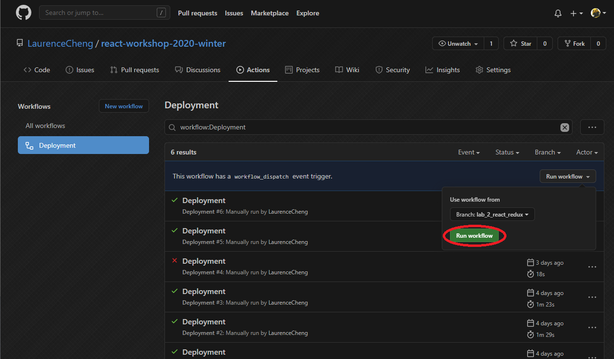

# react-workshop-2020-winter

You can deploy this repository to GitHub Pages to view your React app.

## 1. Click Github `Actions` button

## 2. Click `Deployment`

## 3. Click `Run workflow` and choose the branch you want to deploy

## 4. Click `Run workflow` button

## 5. Wait for the build finished

## 6. Go to `https://<username>.github.io/<repo-name>` to check the pages

e.g. https://laurencecheng.github.io/react-workshop-2020-winter/
